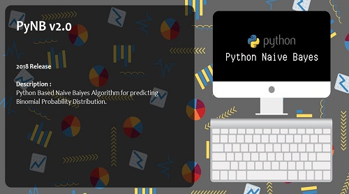

# PyNB-v.1.0

## Brief Description
This is an application that implementing Naive Bayes Algorithm for predicting the output from the datas using sklearn, pandas, numpy and other Libary.
## Brief Guide
1. Install `Python 3` or higher version.
2. Install `sklearn`, `xlsxwritter`, `matplotlib`, `pandas`, `numpy`, and `pillow` using `pip install` or something else.
3. Download all files in this repository.
### For Functional only ver
4. Simply double click on `Functional.py` to run the program.
### For GUI ver
4. Make sure you already installed `tkinter` library in your Python.
5. Double click on `GUI.py` to run program.
